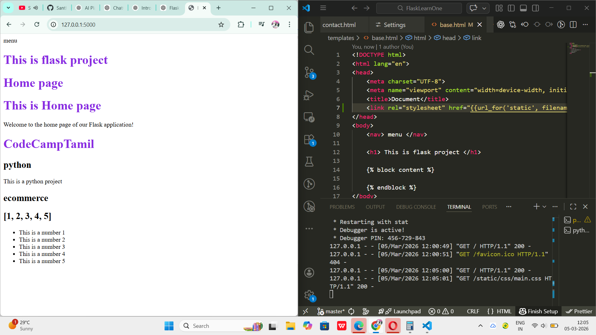
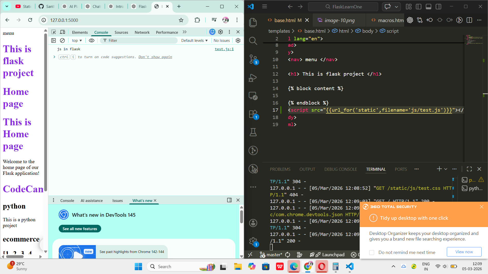
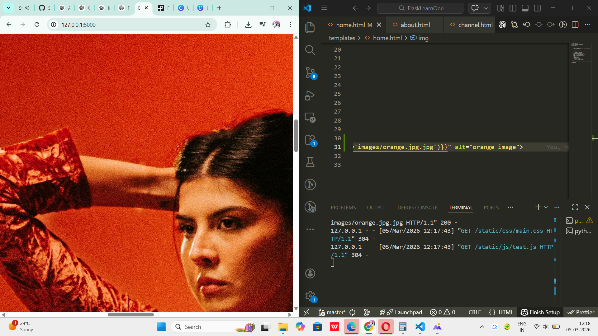
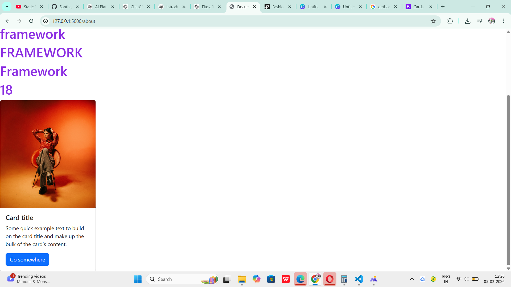

# Flask Learning Notes

This repository contains notes and examples for learning **Flask** and **Jinja2 templates**.

It covers important Flask concepts such as:

* Flask Routing
* URL Variables
* Query Parameters
* Passing Data from Backend to HTML
* Loops in Templates
* Conditional Statements
* Template Inheritance
* Include Templates
* Template Filters
* Custom Filters
* Macros (Reusable Template Functions)

These concepts help build **dynamic and reusable web applications using Flask**.

---

# 1. Flask Routes

In Flask, a **route** connects a URL with a Python function.

Example:

```python
from flask import Flask, render_template

app = Flask(__name__)

@app.route('/')
def home_page():
    return render_template('home.html')
```

⚠️ Important:

If multiple functions use the **same route**, Flask will use **only the first function defined** for that route.

---

# 2. URL Variables

Flask allows us to pass variables directly through the URL.

Example:

```python
@app.route('/contact/<int:age>/<string:name>')
def contact(age, name):
    return f"Name: {name}, Age: {age}"
```

Explanation:

* `int` → Data type
* `age` → Variable name
* `string` → Data type
* `name` → Variable name

Example URL:

```
/contact/25/kishore
```

---

# 3. Query Parameters

Query parameters are values passed through the URL using **key-value pairs**.

Example URL:

```
?name=kishore&age=25
```

To access query parameters in Flask we use `request.args`.

Example:

```python
from flask import request

@app.route('/user')
def user():
    name = request.args.get('name')
    age = request.args.get('age')

    return f"Name: {name}, Age: {age}"
```

Explanation:

* `request` is imported from Flask
* `request.args` stores query parameters
* `.get()` retrieves the value

Anything sent from the frontend (forms, URL, API requests) is called a **request**.

---

# 4. Passing Data from Backend to HTML

We can send data from Flask to HTML templates using `render_template()`.

Example:

```python
@app.route('/')
def home_page():
    return render_template('home.html', language="Python")
```

Access it in HTML using **double curly braces**:

```html
<h2>{{ language }}</h2>
```

Flask can send many data types to templates:

* Strings
* Numbers
* Lists
* Dictionaries

Example:

```python
@app.route('/')
def home_page():
    return render_template(
        'home.html',
        language="Python",
        projectname="ecommerce",
        numbers=[1,2,3,4,5]
    )
```

---

# 5. Using Loops in Flask Templates

Plain HTML does not support loops.

Flask uses **Jinja2 templating**, which allows loops and conditions.

Example image reference:

```
imsage.png
```

Example loop:

```html
<ul>

    <li>{{ num }}</li>

</ul>
```

Example backend code:

```python
@app.route('/')
def home_page():
    return render_template(
        'home.html',
        language="python",
        projectname="ecommerce",
        numbers=[1,2,3,4,5]
    )
```

Example screenshot:

```
image-2.png
```

---

# 6. Conditional Statements in Templates

Jinja templates support conditions like `if`, `elif`, and `else`.

Example screenshot:

```
image-3.png
```

Example code:

```html

    <h2>Python Selected</h2>


    <h2>Java Selected</h2>


    <h2>Other Language</h2>

```

Example screenshot:

```
image-4.png
```

Example output:

```
image-5.png
```

These conditions help display **different UI elements based on logic**.

---

# 7. Template Inheritance

Template inheritance helps avoid repeating common HTML code such as:

* Navbar
* Header
* Footer

Example: Websites like Amazon use the **same navbar on every page**.

Instead of writing it repeatedly, we create a **base template**.

Example base template screenshot:

```
image-6.png
```

Example base template:

```html
<!DOCTYPE html>
<html>
<head>
    <title>My Website</title>
</head>
<body>

<nav>
    <h2>My Navbar</h2>
</nav>




</body>
</html>
```

Block example screenshot:

```
image-7.png
```

Another page extending the base template:

```html




<h1>Welcome to Home Page</h1>


```

This makes code:

* Cleaner
* Reusable
* Easier to maintain

---

# 8. Include Templates

Sometimes we want a component to appear **only in some pages**, not every page.

In that case we use **include**.

Example:

```html

```

Example screenshot:

```
image-8.png
```

This helps reuse small HTML components.

---

# 9. Template Filters

Filters modify how data is displayed in templates.

Example screenshot:

```
image-9.png
```

Example usage:

```html
{{ name | upper }}
```

General syntax:

```html
{{ variable | filtername }}
```

Important:

Filters **do not change the original data**, they only change how it is displayed.

---

# 10. Custom Filters

If the required filter is not available, we can create our own filter in `app.py`.

Example custom filter:

```
image-10.png
```

Example code:

```python
@app.template_filter('reverse')
def reverse_string(s):
    return s[::-1]
```

Using the custom filter in HTML:

```html
{{ name | reverse }}
```

Another example screenshot:

```
image-11.png
```

---

# 11. Macros (Reusable HTML Components)

Macros are similar to **functions**, but used inside templates.

They allow us to create **reusable HTML components**.

Example screenshot:

```
image-12.png
```

Example macro:

```html

    <h3>User: {{ name }}</h3>

```

Using the macro:

```html
{{ display_user("Santhiya") }}
{{ display_user("Kishore") }}
```

Macros help us:

* Avoid repeating HTML
* Write cleaner templates
* Reuse UI components

Macros can also accept parameters and work dynamically.

They can also use **caller blocks** to change content dynamically.

Example idea:

```
macro(name)
```

---

# Summary

This guide demonstrates the following Flask concepts:

* Flask Routing
* URL Variables
* Query Parameters
* Passing Data to Templates
* Jinja2 Loops
* Conditional Rendering
* Template Inheritance
* Include Templates
* Template Filters
* Custom Filters
* Macros

These features help developers build **dynamic and reusable Flask web applications**.

static files and bootstarp:
to have css,js,img,vdo .. we use this to store this kind of things..

since we have inheritance in the flask, we can just to base file(html) so that if any other html file inherites the base file will have that css.


example of the image which shows how it looks after we applied the style;

syntax for importing the file from the static folders.
    <link rel="stylesheet" href="{{url_for('static', filename='css/main.css')}}">

using the js in the static and oupt :


put it in the end od thebody before that body tag closes..

       <script src="{{url_for('static',filename='js/test.js')}}"></script>
used the image and got output:

    

    code to use it , we have used this in the home page only..!


bootstrap  :

got this from bootstarp website :
<link href="https://cdn.jsdelivr.net/npm/bootstrap@5.3.8/dist/css/bootstrap.min.css" rel="stylesheet" integrity="sha384-sRIl4kxILFvY47J16cr9ZwB07vP4J8+LH7qKQnuqkuIAvNWLzeN8tE5YBujZqJLB" crossorigin="anonymous">

copy the first cdn , which is for the css.


we are using it in base.

when we have our own stylesheets and while we are using the bootstrap we need to put our css below the bootstrap.

<script src="https://cdn.jsdelivr.net/npm/bootstrap@5.3.8/dist/js/bootstrap.bundle.min.js" integrity="sha384-FKyoEForCGlyvwx9Hj09JcYn3nv7wiPVlz7YYwJrWVcXK/BmnVDxM+D2scQbITxI" crossorigin="anonymous"></script>

same for js.

<div class="card" style="width: 18rem;">
  
  <div class="card-body">
    <h5 class="card-title">Card title</h5>
    <p class="card-text">Some quick example text to build on the card title and make up the bulk of the card’s content.</p>
    <a href="#" class="btn btn-primary">Go somewhere</a>
  </div>
</div>

got it from bootstrap website . docs/card..


card used output..

used the code in the page i wannted to have this card , and used my own image alt text , cause they wont give any text by their own
